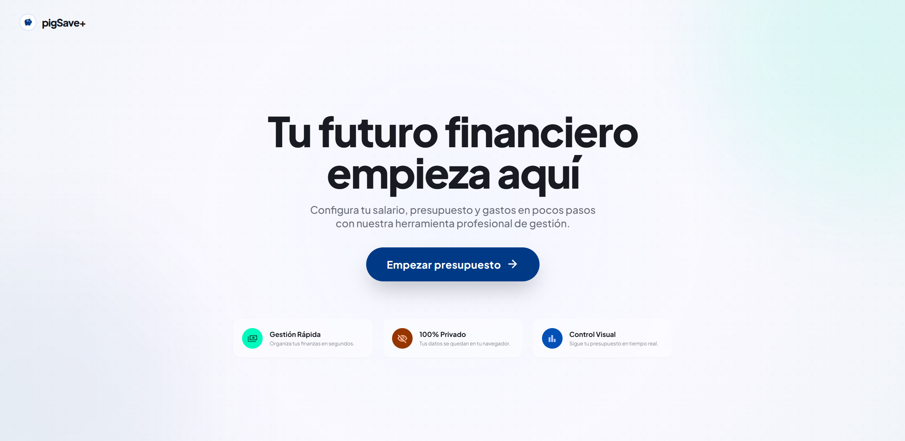
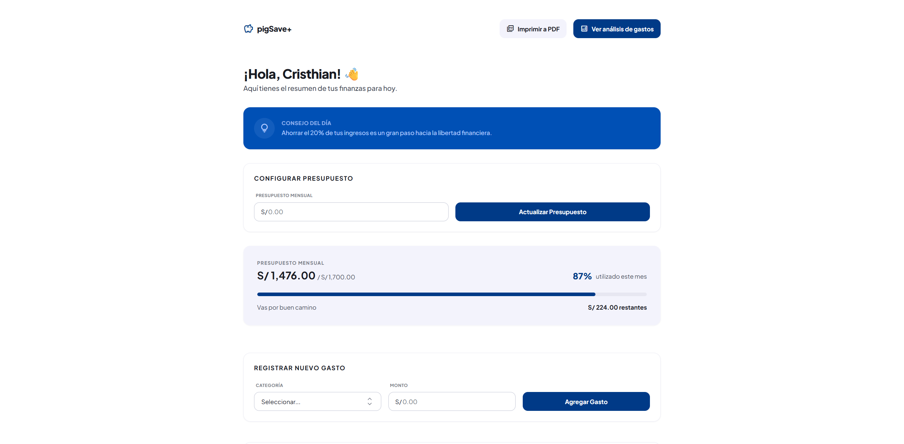
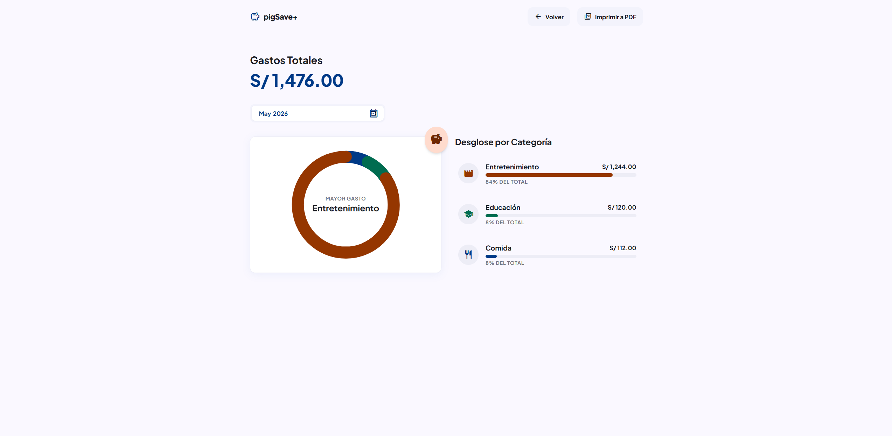

# pigSave+ 🐷💰

**pigSave+** es una herramienta web intuitiva diseñada para ayudarte a gestionar tus finanzas personales de manera sencilla y eficiente. Permite llevar un control riguroso de tus gastos mensuales, visualizar el estado de tu presupuesto en tiempo real y analizar tus hábitos de consumo mediante gráficos detallados.

## 🚀 Propósito del Proyecto

El objetivo principal de pigSave+ es fomentar la salud financiera de los usuarios permitiéndoles:
- Establecer un presupuesto mensual claro.
- Registrar gastos diarios categorizados.
- Visualizar rápidamente qué porcentaje del presupuesto ha sido utilizado.
- Identificar las categorías de mayor gasto mediante análisis visual.

## 🛠️ Tecnologías Utilizadas

Este proyecto fue construido utilizando tecnologías web modernas:
- **HTML5:** Estructura semántica de la aplicación.
- **Vanilla CSS:** Estilos personalizados y transiciones suaves.
- **Tailwind CSS:** Framework de utilidades para un diseño moderno, responsivo y "mobile-first".
- **JavaScript (Vanilla JS):** Lógica de negocio, gestión de estado local y manipulación del DOM.
- **localStorage API:** Para la persistencia de datos en el navegador sin necesidad de una base de datos externa.
- **Material Symbols:** Iconografía limpia y profesional de Google.

## ✨ Funcionalidades

- **Gestión de Presupuesto:** Configura y actualiza tu presupuesto total del mes.
- **Registro de Gastos:** Agrega, edita y elimina gastos especificando monto y categoría (Comida, Educación, Entretenimiento, Ahorro).
- **Semáforo Visual:** Barra de progreso dinámica que cambia de color según el uso del presupuesto (con alertas de límite casi alcanzado o excedido).
- **Panel de Control (Dashboard):** 
    - Gráfico de "donut" SVG interactivo para ver la distribución de gastos.
    - Desglose detallado por categoría con porcentajes.
    - Filtro por mes para revisar históricos.
- **Exportación a PDF:** Genera un reporte imprimible de tu estado financiero actual.

## 📖 Cómo Usarlo

1. **Bienvenida:** Ingresa tu nombre para personalizar tu experiencia.
2. **Configurar:** En la sección "Billetera", establece tu presupuesto mensual en soles (S/).
3. **Registrar:** Selecciona una categoría (ej. Comida), ingresa el monto y haz clic en "Agregar Gasto".
4. **Analizar:** Haz clic en "Ver análisis de gastos" para ir al Dashboard y ver los gráficos de tus consumos.
5. **Reporte:** Usa el botón "Imprimir a PDF" si deseas guardar una copia física o digital de tu resumen.

## 👥 Contribuidores

Este proyecto ha sido desarrollado con el esfuerzo de:

- **Cristhian** - [GitHub Profile](https://github.com/CristhAXe)
- **Alexis** - [GitHub Profile](https://github.com/alexisdaniel962015-stack) 

---
*Desarrollado como Proyecto Final para el Módulo 5 Enter Tech School 201.*

## 📸 Capturas de Pantalla

| Billetera | Dashboard |
|---|---|
|  |  |
